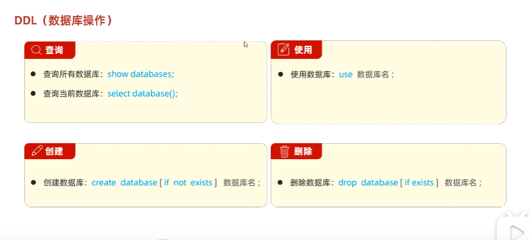

- SQL语句必须以==分号（;）== 作为结束标志，==--== 为注释符，且语句不区分大小写
# DDL语句

1. 显示所有数据库
- show databases; 
2. 创建数据库 
-  create database *库名*;  
3. 切换数据库
- use [dbname]; 
4. 查看当前所在数据库
- select database();
5. 删除数据库
- drop database [dbname];