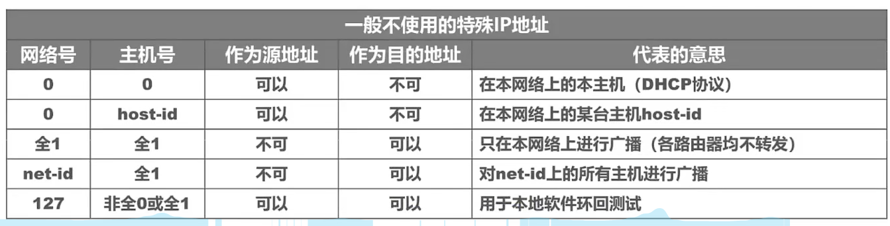
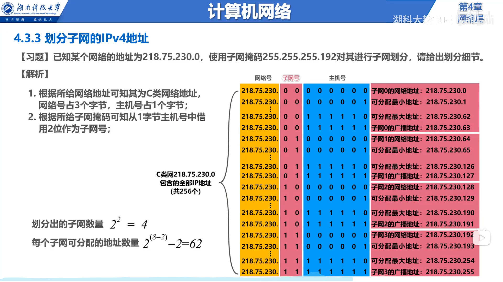
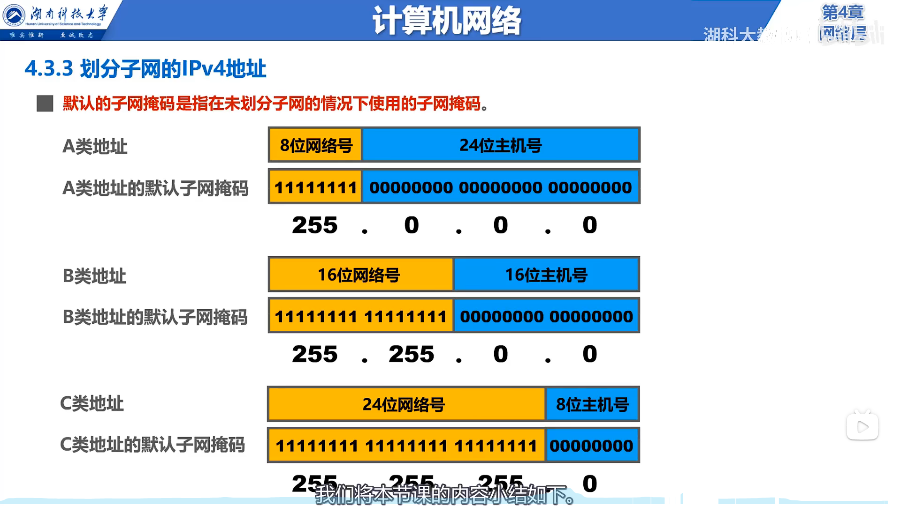

# 分类编址的IPV4地址
## 特殊IP地址
- 如下图：

> **注意：** ==全0==（网络地址）、==全1===（广播地址）**都不能**分配给各个接口。
***
# 划分子网的IPV4地址
- **为新增网络申请新的网络号会带来以下弊端:**
    - 需要等待时间和花费更多的费用
    - 会增加其他路由器中路由表记录的数量
    - 浪费原有网络中剩余的大量IP地址

==由此可从原有的多余的**主机号部分借用**一部分作为子网号==

## 子网掩码

- **32比特的子网掩码可以表明分类IP地址的主机号部分被借用了几个比特作为子网号**：
  - 子网掩码使用==连续的比特1来对应网络号和子网号==
  - 子网掩码使用==连续的比特0来对应主机号==
  - 将划分子网的**IPv4地址**与其相应的**子网掩码**进行==逻辑与运算==就可得到IPv4地址所在**子网的网络地址**

***熟悉例题***：
> ***要点：***一般可通过**主机IP地址**判断属于哪类IP地址（A、B、C），再通过**子网掩码**确定==借用几位主机号当子网号==

- **默认的子网掩码是指在未划分子网的情况下使用的子网掩码**

***
# 无分类编址的IPV4地址

