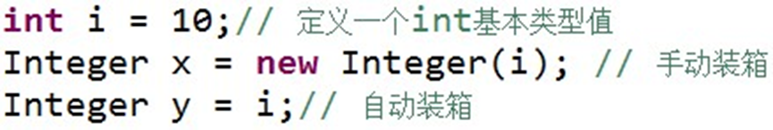
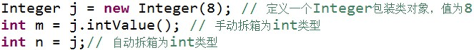
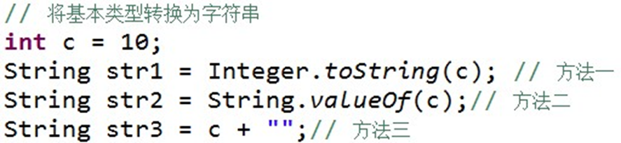
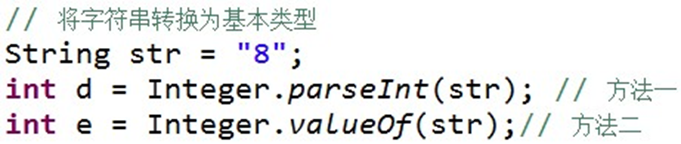

# 类与面向对象
## 抽象类和接口的区别
- *抽象类*中的==方法可以在其中实现==，而***接口***不能将方法实现
- 一个类可以实现==多个接口==
- 接口==不能存在**静态方法**==
# java的类
## String类
1. **split()方法**
- 语法
> split(String regex,int limit);
> **参数**
> - regex -- 正则表达式分隔符
> - limit -- 分割的份数

**注意：**
- `.`、`$`、`|`、`*`等转义字符必须得加`\\`
- 多个分隔符，用`|`作为连字符
- 当**分割符**位于==开始==或==结尾==时，仍将字符串分成两半，如`.java`,当用"."为分隔符时，将其拆分为==空字符串`""`和java==

**eg:**
```java
public class Test {
    public static void main(String args[]) {
        String str = new String("Welcome-to-Runoob");
 
        System.out.println("- 分隔符返回值 :" );
        for (String retval: str.split("-")){
            System.out.println(retval);
        }
 
        System.out.println("");
        System.out.println("- 分隔符设置分割份数返回值 :" );
        for (String retval: str.split("-", 2)){
            System.out.println(retval);
        }
 
        System.out.println("");
        String str2 = new String("www.runoob.com");
        System.out.println("转义字符返回值 :" );
        for (String retval: str2.split("\\.", 3)){
            System.out.println(retval);
        }
 
        System.out.println("");
        String str3 = new String("acount=? and uu =? or n=?");
        System.out.println("多个分隔符返回值 :" );
        for (String retval: str3.split("and|or")){
            System.out.println(retval);
        }
    }
}

/*- 分隔符返回值 :
Welcome
to
Runoob

- 分隔符设置分割份数返回值 :
Welcome
to-Runoob

转义字符返回值 :
www
runoob
com

多个分隔符返回值 :
acount=? 
 uu =? 
 n=?
*/
```

2. **trim()方法**
*用于删除字符串头尾空白符*
- 语法：
> trim();

- 无参数

***返回一个删除空白符的字符串***

**eg:**
```java
public class Test {
    public static void main(String args[]) {
        String Str = new String("    www.runoob.com    ");
        System.out.print("原始值 :" );
        System.out.println( Str );

        System.out.print("删除头尾空白 :" );
        System.out.println( Str.trim() );
    }
}

```

---
## StringBuffer类
- 初始化
> StringBuffer stringBuffer = new StringBuffer();
> StringBuffer stringBuffer = new StringBuffer("Hello World!");

- **StringBuffer对象和String对象互转**
==错误方式==：
> StringBuffer s = "abc";  //**赋值类型不匹配**
> StringBuffer s = (StringBuffer)"abc";  //**不存在继承关系，无法进行强转**

==正确方式：==
> String string1 = "Hello World!";
StringBuffer stringBuffer = new StringBuffer(string1);  //**String转换为StringBuffer**
String string2 = stringBuffer.toString();  //**StringBuffer转换为String**

- **函数方法**
1. append()函数
```java
StringBuffer stringBuffer = new StringBuffer("Hello");
stringBuffer.append("World!");
System.out.println(stringBuffer);

```

2. reverse()函数
```java
StringBuffer stringBuffer = new StringBuffer("abc");
System.out.println(stringBuffer.reverse());

```

## 包装类
- **装箱和拆箱**




- **将包装类转换成其他数据类型**
```java
Integer i = new Integer(100);
//转换成double类型
double d = i.doubleValue();
System.out.println("d的值：" + d);
//转换成float类型
float f = i.floatValue();
System.out.println("f的值" + f);

```
- **如何将基本数据类型转换成字符串**


- **如何将字符串转换成基本数据类型**



