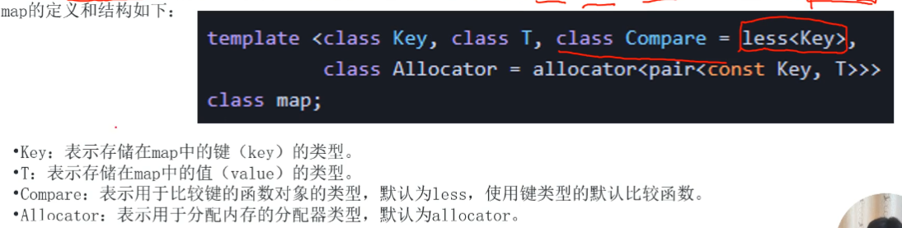
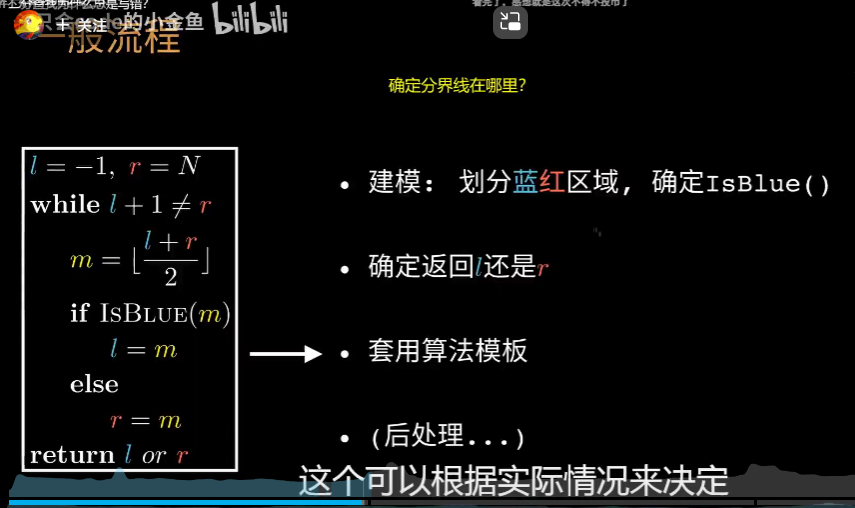

# 万能头
> 代码：`#include <bits/stdc++.h>`
***
# 输入输出
- **取消同步流**
代码：`ios::sync_with_stdio(0),cin.tie(0),cout.tie(0);`

***
# 字符串相关输入输出
- **一种新的循环访问元素**

```c++
for (int i : arr) {
    // 循环体，使用 i 访问数组元素
}
```
> **注意**：一般用于==容器（或数组，字符串等类似的数据结构）==，以访问某个类型的元素，简便可写为`for (auto i : arr)`

## reverse函数
> **reverse函数通常用于==反转==容器（如数组、字符串、向量等）中的元素顺序。为了使用reverse函数，你需要包含 ==algorithm== 头文件，**

- **语法**：`reverse(begin(arr),end(arr));`

**示例**：
```c++
#include <iostream>
#include <algorithm>  // 包含 <algorithm> 头文件

int main() {
    int arr[] = {1, 2, 3, 4, 5};

    // 使用 reverse 函数反转数组元素的顺序
    std::reverse(std::begin(arr), std::end(arr));

    // 输出反转后的数组
    for (int i : arr) {
        std::cout << i << " ";
    }

    return 0;
}

```
***

# 排序（sort）
- **用法**
sort（起始地址，结束地址的下一位，比较函数）
>  ==比较函数默认<号==要加头文件：**algorithm**


- **示例**：
    - 数组
```c++
int a[100];
int n;
cin >> n;
for (int i = 1;i <= n;i++)cin >> a[i];
sort(a+1,a+n+1);
```
  - 容器
```c++
vector<int> v = {5,1,3,9,11};
sort(v.begin(),v.end());

```

## 自定义比较函数
第三个参数可以是**函数**或**lambda表达式**
- **函数形式**
```c++
bool cmp(const int &u,const int &v)
{

    return u > v;
}
int main()
{
vector<int> v = {5,1,3,9,11};
sort(v.begin(),v.end(),cmp);
return 0;
}
```

- **lambda表达式形式**
```c++
vector<int> v = {5,1,3,9,11};
sort(v.begin(),v.end(),[](const int &u,const int &v)
{

    return u > v;
});

```

---

# 最值查找（max、min等）
## min和max函数


`min(a,b);`返回a和b较小的值
> 其中十六进制数==0x3f3f3f3f==在很多算法中被用作为一个**无穷大**或**极大**的值

- 也**可传一个列表**
如：
min({1,2,3,4}) = 1

> max同理

## min_element和max_element

`min_element(st,ed);`
返回地址[st,ed)中最小值的下标（迭代器），**传入参数**为两个==地址或迭代器==。

- **示例**
```c++
vector<int> v = {5,1,3,9,11};

// 输出最大的元素，要用*解引用，通过地址（迭代器）得到值
cout << *max_element(v.begin(),v.end());

```

> 关于迭代器：
> 迭代器让你能够逐个查看或处理一组数据，而不必一次性处理所有数据。这对于大量数据或需要逐步处理的情况非常有用。使用迭代器，你可以一个接一个地获取数据，而不必关心整个数据集的大小和结构。在编程中，迭代器通常有两个按钮：一个用于获取下一个数据（比如电视遥控器上的下一频道按钮），另一个用于检查是否还有数据可获取。这种方式让你能够以逐步的方式处理数据，非常方便。
>
> 迭代器相关内容可参考[STL]()

## nth_element函数

`nth_element(st,k,ed);`
进行部分排序
**传入参数**为==三个==地址（迭代器）

> 其中**第二个参数位置的元素将处于正确位置**，其他位置元素的顺序可能是任意的，但==前面的比他小，后面的比他大。==

- **示例**：
```c++
vector<int> v = {5,1,7,3,10,18,9};
nth_element(v.begin(),v.begin() + 3,v.end());  //begin()+3的位置在“7”

for (const auto &i : v)cout << i << " ";

```

***

# 二分查找（binary_search函数）

- **语法**：
`binary_search(st,ed,target);`

> **target**是==目标元素==

## binary_search函数

- **二分查找的前提**
    - 库函数==只能对数组==进行二分查找
    - 对数组进行额二分查找的前提是**数组元素是==单调==的**

> 通过二分查找算法来确定序列中==是否存在目标元素==
> 函数返回一个==bool值==表示是否存在


## lower_bound和upper_bound

`lower_bound(st,ed,x);`返回地址[st,ed)中**第一个**==大于等于x==的元素的**地址**
`upper_bound(st,ed,x);`返回地址[st,ed)中**第一个**==大于x==的元素的**地址**

> 若不存在则返回**最后一个元素**的**下一个位置**

> 用法：
> 1. 若在一个数组或者容器中存在**重复的元素**，则可利用这两个函数即==上界-下界==就能得到该***重复元素的个数***，但必须**注意**：**使用前**必须给数组或容器==排序==！（详见[sort](#排序sort)
***
# 大小写转换

## islower/isupper函数

> 是字符分类函数，用于检查一个字符是否为大小写，要包含头文件**cctype**,返回值为**bool**类型


## tolower/toupper函数

`tolower(char ch)`
可以**将ch转换为小写字母**，如果**不是大写字母**则==不进行操作==。toupper同理

---

# 全排列

## next_permutation函数

`next_permutation(st,ed);`函数用于生成当前序列的下一个排列，它按照字典序进行排列，如果**存在下一个序列**，则将**当前序列更改为下一个序列**，并**返回true**;如果当前序列是**最后一个排列**，则将序列==更改为第一个排列==，并**返回false**

> **prev_permutation与其相反**


***

# 其他库函数

## memset函数


## swap函数


## unique函数


> 注意：如果要消除**不相邻但重复**的元素，==要先排序后再使用unique==


***
# STL
## pair

> **注意**：要加头文件**utility**

示例：

```c++  
int main()
{
    pair<int,double> p1(1,3.14);
    cout << p1.first << "," << p1.second;
    
    return 0;}
```

- pair的嵌套


- 其他示例


# vector

vector是一个动态数组容器，可以存储一系列相同类型的元素，要加头文件**vector**

`push_back();`将元素添加到vector的末尾

`pop_back();`删除vector末尾的元素
> ps.一定要保证vector**非空**

`begin();end();`指向vector**第一个元素**和**最后一个元素==之后==位置**的迭代器

`insert();`在指定位置插入元素，第一个参数是插入**位置**，第二个参数是插入**数据**

`erase();`删除指定位置的元素。参数为**一个**时，==只删除该元素==；参数为**两个**时，则==删除范围内的元素==（仍是左闭右开）


`size();`函数获取容器中元素的数量

`empty();`函数检查容器是否为空

`clear();`函数清空操作


# list(不常用)
list容器接受两个参数：
1. 元素类型
2. allocator（可选）：指定用于分配内存的分配器类型（**一般默认不变**）

> list是==双向链表==，要加头文件**list**

`push_front();`在链表头部插入元素
> 尾部插入和vector一样

- 函数


# stack

> 同样要加头文件**stack**

- 常用函数


- 示例


# queue队列


## priority_queue优先队列


- 修改比较函数


## 双端队列（单独考察不常见）


# set


## set集合
set内部实现了使用红黑树来存储元素，并保持元素的有序性


- 函数：


- 修改set常见的方法


- 示例：


## multiset多重集合

> 与set类似，用于存储一组元素，并按照排序规则进行排序。不同之处再与multiset容器==允许存储重复的元素==
>

- 函数：


> 注意：erase函数，写成`erase(x);`则会把集合中==所有x元素都删除==，如果只删除一个，则写成`st.erase(st.find(x));`

- 示例：

## unordered_set无序集合


- 函数：


- 示例：


# map

map容器是一种关联容器，用于存储一组==键值对==，**每个键**都是**唯一的**，map根据键自动排序；map容器使用红黑树来实现



- 函数


- 示例：


## multimap


- 函数：
***同上***

- 示例：


## unordered_map


- 示例


***
# 经验总结（易错归纳）
## 二维数组篇
1. 遇到类似于**矩阵或者是二维数组**存储的题，若要访问**某个点周围的8个数据**可用如下，便可处理边界问题（其中**i**为==当前所在位置==）
```c++
for(int p = max(1,i-1);p < min(n,i+1);p++ )
```
2. 或者将**二维数组**的存储==从**下标1**开始存储==，这样即使发生越位，但每次都不会去访问越位的下标，也能粗略地解决边界问题

## 循环篇
1. 循环语句，特别是***嵌套循环***中，必须十分注意一些**局部变量**的*改变及更新*必须放在**哪一层循环中**，非常容易出错（通常该变量需要更新几次就放在相应次数的循环中）

2. 也是在循环中，尤其要注意一些成规模的数据，它要从**一个状态**转变为**下一个状态**，最好==再设立一个相同的数据类型==，以**存储中间的处理结果**，最后再将结果赋值过来，形成新的状态，可参考蓝桥杯[灌溉](https://www.lanqiao.cn/problems/551/learning/?page=1&first_category_id=1&name=%E7%81%8C%E6%BA%89)题
   1. 或者说，当前状态下，数据中的**单个元素**能==影响到下一状态==，且用到循环来枚举所有元素以获取下一状态的情况时，尤其要注意上方所说的问题。**总之，要能够在某一时刻下==区分出==当前状态和下一状态**

## 数值类型转换篇
1. 如字符串函数==length()== 它返回的数值类型是==size_t==类型的，如果将其与整型数据（int）直接比较有些编译器可能会报错，最好使用强制转换将其转换成对应类型。

## 命名问题
1. 对自定义的函数或变量进行命名时要注意**避免**与==关键字重名==或者是与==库函数重名==问题，否则会造成重载（overload）等问题，最好命名时多加**下划线(_)**
# 基础算法篇
## 枚举

**通过穷举所有可能的情况**来解决问题，适用于==规模较小，解空间可穷举==的情况

> 解空间可以是**一个范围内的所有数字**（或二元组、字符串等），或**满足条件的所有数据**。**简单的**可直接***用循环***来暴力==枚举==解空间

## 递归
- 带备忘录的递归

```c++
const int N = 1e5+9;
int dp[N];
int fib(int n)
{
    if(dp[n])return dp[n];
    if(n <= 2)return 1;
    return dp[n] = fib(n-1) + fib(n-2);
}
int main()
{
    int n;cin >> n;
    for(int i = 1;i <= n;i++)
    cout << fib(i) << endl;
    return 0;
}
```

> 使用一个数组来**存储已经计算过的结果**，当循环调用时就==不会重复计算==之前已经计算的结果。


```c++
int a[N];
int dfs(int dep)
{
    int res = 1;
    for(int i = 1;i <= a[dep-1] / 2;i++)
    {
        a[dep] = i;
        res = res + dfs(dep+1);
    }

    return res;
}
int main()
{
    int n;
    cin >> n;
    a[1] = n;
    cout << dfs(2);
    return 0;
}
```

> 递归是一种编程思想，适用于问题可以*自然地分解为较小的相似子问题*的情况。以下是一些明显的特征，表明在编程中使用递归思想可能是合适的：
1. **问题具有自相似性：** 问题可以分解为类似但规模较小的子问题。每个***子问题***的解决方案都***能够用相同的方法***来解决。
2. **问题可以被分解为子问题：** 问题可以被划分为若干个规模较小的子问题，这些子问题可以独立地解决，并且它们的解决方案可以***组合起来得到原始问题的解***。
3. **递归调用不会导致无限循环：** 递归函数必须在某个时刻能够达到基本情况，避免无限递归。基本情况是问题规模足够小，可以直接解决而无需继续递归。
4. **问题的解决可以通过多次调用自身的简单操作完成：** 递归通常适用于解决相同问题的多个步骤或层次，每一步都是相似的，且较为简单。
5. **数据结构的递归性质：** 当问题涉及到递归数据结构（如树、图）时，递归通常是一种自然的解决方案。树结构是递归的典型例子，每个子树都是原始问题的一个规模较小的实例。
6. **代码的简洁性和可读性：** 在某些情况下，递归可以使代码更加简洁和易于理解，因为它可以自然地表达问题的分解和解决过程。


## 进制转换

- 任意进制转换为10进制
*假设用一个数组来表示==k进制==的整数*

```c++
long long  x = 0;
for(int i = 1;i <= n;i++)
{
    x = x * k + a[i];
} 
cout << x;
```

- 十进制转换为任意进制
```c++
//数组存储
long long  x;
cin >> x;
while(x)
{
    a[++cnt] = x % k;
    x /= k;
}
reverse(a+1,a+1+cnt);

//或用字符串（一般用于十进制以上）
ch[] = {'0','1','2','3','4','5','6','7','8','9','A','B','C','D','E','F'};
long long  x;
string ans;
cin >> x;
while(x)
{
    ans +=  ch[x % k];
    x /= k;
}
reverse(ans.begin(),ans.end());

```
- 将N进制转换成M进制（都非十进制）
> 将==N==进制==转换为十进制==，再将==十进制==转==换为M进制==


## 前缀和（prefix）
> 前缀和是一种数组预处理技巧，它可以有效地解决一些与**数组区间和**相关的问题。
- 特性
prefix[i] = prefix[i-1] + a[i]
  - 数组**下标均从1 开始**，a[0] = prefix[0] = 0,循环计算即可。
`for(int i = 1; i <= n;i++)`
`prefix[i] = prefix[i-1] + a[i];`

- 求区间和
sum（L,R）= prefix[R] - prefix[L-1]

> **注意**：前缀和数组**不能实现**==“边修改边查询（区间和）”==


### 适用场景


1. **子数组和的查询：** 如果需要在数组中频繁查询某个子数组的和，前缀和是一种有效的方法。通过预先计算前缀和数组，可以在O(1)的时间内回答任意子数组的和查询。

2. **连续子数组的和等于特定值：** 如果问题要求找到***数组中==和为特定值==的连续子数组***，前缀和可以帮助快速定位这些子数组。通过将问题转化为求解两个前缀和之差等于特定值的问题，可以在O(n)的时间内解决。

3. **区间和的更新：** 当需要在数组的某个区间内进行元素的更新，并频繁查询区间和时，前缀和可以提供高效的解决方案。更新操作可以通过更新前缀和数组来实现。

4. **区间和的平均值：** 如果需要计算数组中某个区间的平均值，前缀和可以用来在O(1)的时间内计算出该区间的和，从而得到平均值。

5. **连续子数组的最大/最小和：** 前缀和可以用来优化求解最大子数组和或最小子数组和的问题。通过观察前缀和的性质，可以在O(n)的时间内找到最大或最小子数组和。

6. **循环数组中的子数组和问题：** 如果数组是一个循环数组，前缀和同样可以应用于解决子数组和的问题。需要注意的是，在计算两个前缀和之差时，要考虑数组的循环性。

- eg:

- 代码：
```c++
#include <iostream>
#include <cstring>
#include <algorithm>

#define x first
#define y second

using namespace std;

typedef long long LL;
typedef pair<int, int> PII;

const int N = 1e5 + 10;

int n;
PII q[N];
LL pre[N], nex[N];

int main()
{
    cin >> n;
    for (int i = 1; i <= n; ++ i )
    //         重量       位置
        cin >> q[i].y >> q[i].x;
    
    sort(q + 1, q + n + 1);
    
    LL s = 0;
    for (int i = 1; i <= n; ++ i ) 
    {
        
        pre[i] = pre[i - 1] + s * (q[i].x - q[i - 1].x);
        s += q[i].y;
    }
    
    s = 0;
    for (int i = n; i >= 1; -- i )
    {
        
        nex[i] = nex[i + 1] + s * (q[i + 1].x - q[i].x);
        s += q[i].y;
    }
    
    LL res = 1e18;
    for (int i = 1; i <= n; ++ i )
        res = min(res, pre[i] + nex[i]);
    
    cout << res << endl;
    
    return 0;
}
```
> 总结：当**遍历每个状态**的结果都需要**相同方法的计算时**，可考虑使用前缀和减少一些重复的计算，减少时间复杂度。同时前缀和也可灵活变通为“后缀和”，两者可结合在一起使用

## 差分

- 特性
diff[i] = a[i] - a[i-1]

- **对差分数组做前缀和可以还原为原数组**
$$
\sum_{n = 1}^{i} diff[n]  = a[i]
$$

- 实现
`for(int i = 1; i <= n;i++)`
`diff[i] = a[i] - a[i-1];`

- **差分数组可以实现快速的区间修改**
*将区间[l,r]都加上x的方法：*
`diff[l] += x;`
`diff[r+1] -= x;`
最后再用前缀和还原成原数组
> **注意**：差分数组**不能实现**==“边修改边查询（区间和）”==

## 离散化

> 将**数组的==值域压缩==**，从而*更加关注元素的大小关系*的算法
> 适用场景：
> 当==原数组数字很大、负数、小数时==，***难以将“元素值”表示为数组下标***，一**些依靠下标**实现的算法和数据结构*无法实现时*，就将其**离散化**。

**注意**：


> 其不会单独考察，**一般会结合如==树状数组、线段树、二维平面的计算几何==等考察**

## 贪心算法

- 模型和例题

解答：
```c++
#include <bits/stdc++.h>
using namespace std;
priority_queue<long long,vector<long long>,greater<long long>> p;
int main()
{
  int n;
  cin >> n;
  for(int i = 0;i < n;i++)
  {
    int x;
    cin >> x;
    p.push(x);

  }
  int ans = 0;
  while(p.size() > 1)
  {
    int x = p.top();p.pop();
    int y = p.top();p.pop();
    ans += x + y;
    p.push(x+y);
  }
  cout << ans << "\n";

  // 请在此输入您的代码
  return 0;
}
```


> 本题的贪心策略为：**每次的分组**都要==最大程度的利用空间==（反过来说就是每次要**使分组空间的==余量最小==**），则充分利用好空间后，就会使得分组数量最少。故每次当最大和最小的组合满足容量大小时则为一组，否则最大的那个单独为一组（***始终秉持着空间余量最小原则，即贪心***）

解答：
```c++
#include <bits/stdc++.h>
using namespace std;
const int N = 3e4 + 9;
int a[N];
int main()
{
  int w,n;
  cin >> w;
  cin >> n;
  for(int i = 1;i <= n;i++)
  {
    cin >> a[i];
  }
  sort(a+1,a+1+n);
  int l = 1,r = n;
  int ans = 0;
  while(l <= r)
  {
    if(l == r)
    {
      ans++;
      break;
    }
    if(a[l] + a[r] <= w)
    {
      l++;r--;
    }
    else
    {
      r--;

    }
    ans++;
  }
  cout << ans << '\n';


  
  return 0;
}

```

## 双指针
通常用于*数组或者字符串*中进行**快速查找、匹配、排序或移动**操作。

并非真的用指针，一般使用两个变量来表示下标

### 对撞指针


### 快慢指针
指的是两个指针**从同一侧开始遍历序列**，移动的步长一个快一个慢。
两个指针以不同速度和策略移动，**直到快指针移动到数组尾端，或者两指针相交，或者其他特殊条件。**


例题：


解答：
```c++
#include <bits/stdc++.h>
using namespace std;
const int N = 1e5 + 10;
int a[N];
int main()
{
  ios::sync_with_stdio(0),cin.tie(0),cout.tie(0);

  int n,s;
  cin >> n >> s;
  for(int i = 1;i <= n;i++)
  {
    cin >> a[i];
  }
  int r = 0;
  int sum = 0;
  int ans = n+1;
  for(int l = 1;l <= n;l++)
  {
    while(r < l || ((r + 1 <= n)&&(sum < s)))
    {
      sum += a[++r];
    }
    if(sum >= s)
    {
      ans = min(ans,r-l+1);
    }
    sum -= a[l];
  }
  if(ans > n)
  {
    cout << 0;
  }
  else
  {cout << ans;}

  // 请在此输入您的代码
  return 0;
}
```
## 二分法
> 二分法适用于**有序数据集合**，每次迭代可以将搜索==范围缩小一半==

### 整数二分
> 就是在一个已有的==有序数组上==，进行二分查找，一般为找出某个值的位置，或者是找出分界点。


- 流程：


- 模板：
```c++
//找到升序数组a中的x第一次出现的位置
int l = -1;,r = 1e9;
while(l + 1 != r)//相邻退出
{
  int mid = (l + r) / 2;
  if(a[mid] >= x) r = mid;
  else l = mid;
}
cout << r;


int a[200];
for (int i = 0; i < 200; i++)
{
    a[i] = 4 * i + 6;
}
int x;
cin >> x;
int l = -1, r = 199;
while (l + 1 != r)
{
    int mid = (l + r) / 2;
    if (a[mid] <= x)
        l = mid;
    else
        r = mid;
}
cout << l;
return 0;

```

### 二分答案
- 模板：

> 二分答案实际上就是在有序序列整数二分的基础上，==存在一个和该序列**单调性一样**的对应函数==，那么，通过对函数值的二分查找，能找到某个对应值区间的上下界，得出答案。对于这种题，常出现的问法有：“**最小xx中的最大xx**”或者“**最大中的最小**”，前者对应的是二分查找区间的==上界==，==后者为下界==。

- eg:


- 代码示例：
```c++
#include <bits/stdc++.h>
using namespace std;
const int N = 5e4 + 9;
long long  a[N];
int n,m;
long long L;
int check(int mid)
{
  int num = 0;
  int lst = 0;
  for(int i = 1;i <= n;i++)
  {
    if(a[i] - a[lst] < mid) 
    {
      num++;
      continue;
    }
    
      lst = i;
    
  }
  if(L - a[lst] < mid) return m+1;
  return num;


}
int main()
{
  
  cin >> L >> n >> m;
  for(int i = 1;i <= n;i++)
  {
    cin >> a[i];
  } 
  long long l = 0, r = 1e9+5;
  while(l + 1 != r)
  {
    long long mid = (l + r) / 2;
    if(check(mid) <= m) l = mid;
    else r = mid;
  } 
  
  cout << l;
  return 0;
}
```